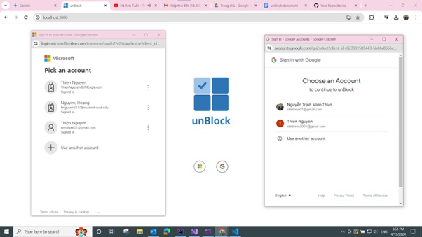
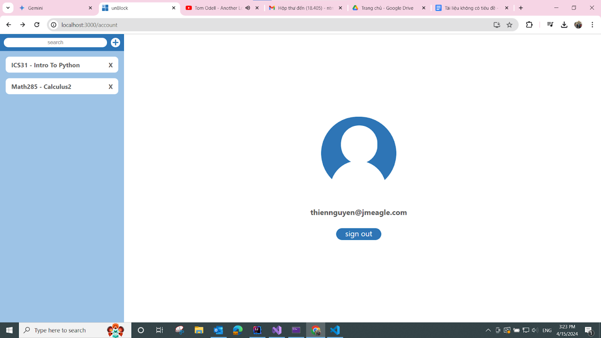
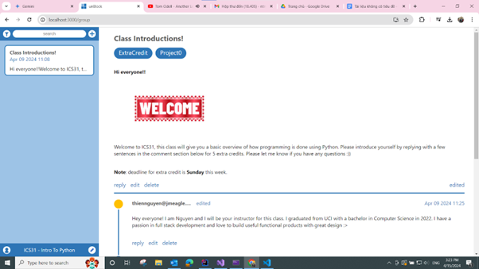
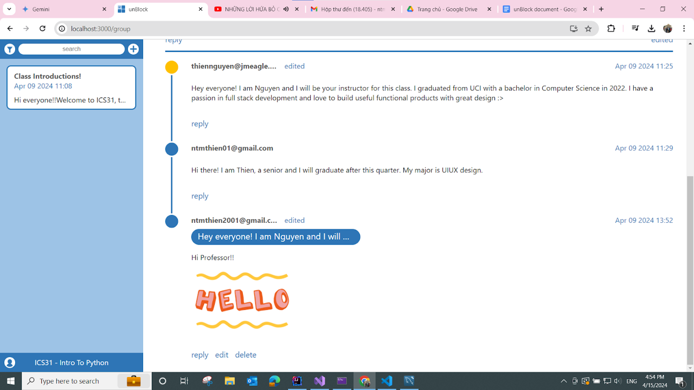
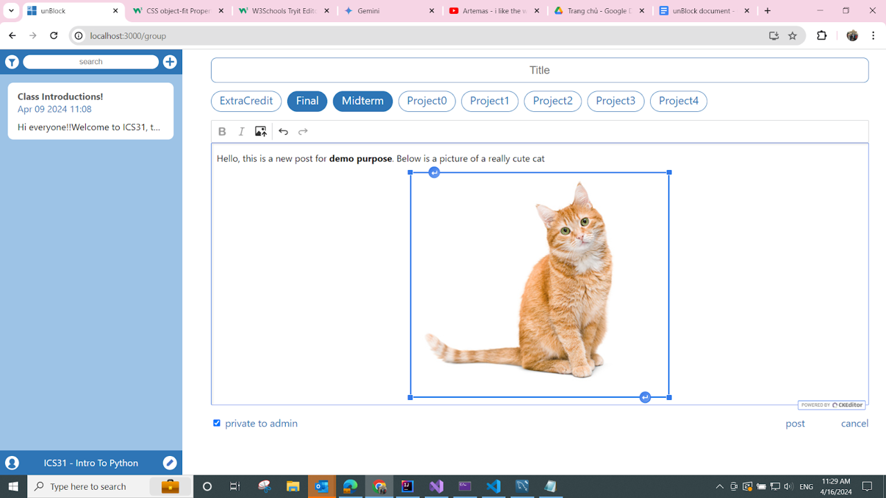

# unBlock

unBlock is a web app for teachers to create engaging virtual classrooms where students can ask, discuss and answer questions

<ul>
  <li>Front-end interface is implemented with ReactJS (HTML, CSS, JavaScript).</li>
  <li>Back-end is built with Java Spring Boot and C# ASP.NET.</li>
  <li>Database in MySQL and AWS S3 for cloud-based files storage</li>
</ul>
 

User can sign in using their Microsoft or Google account

 
 

User can add new discussion groups or can be added to other’s discussion groups

 

For each group, user can see posts from other group members for discussion

 

For each post, user can see comments from other group members for discussion

 

For each group, user can post questions to discuss with other group members

 
